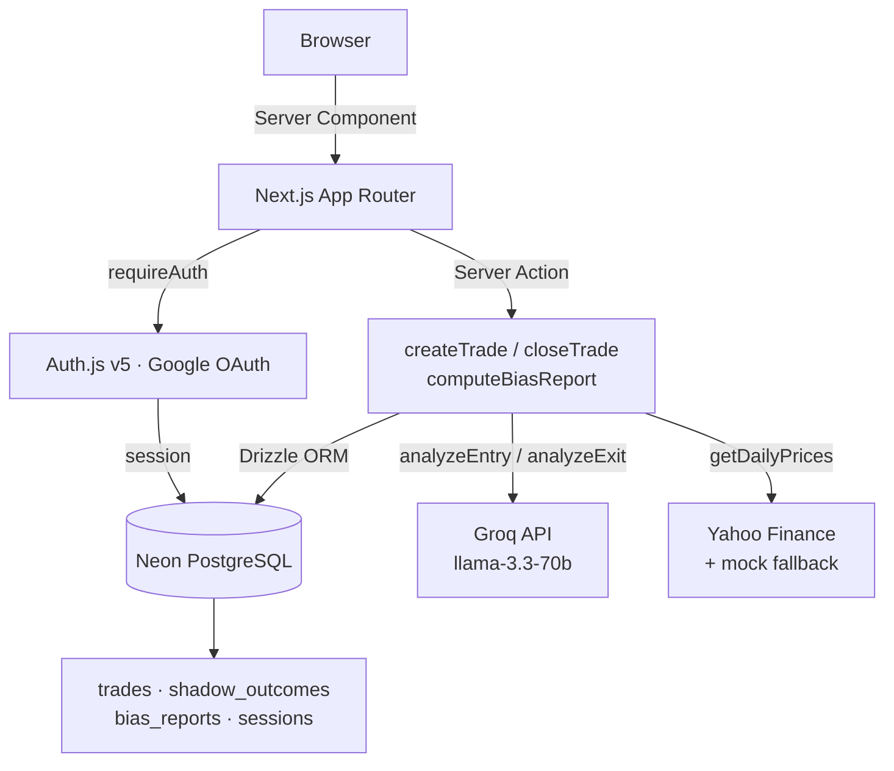

# AlphaJournal

A trade journal for Indian retail traders that quantifies the financial cost of cognitive biases. Most retail investors underperform the Nifty 50 not because they pick bad stocks, but because they make predictable behavioral mistakes — holding losers too long, revenge trading after losses, chasing tips. AlphaJournal puts a rupee figure on each of those mistakes.

**[Live Demo →](https://stock-journal-mu.vercel.app)**

---

## Demo

Sign in with any Google account to start journaling immediately. To see a pre-populated journal with all bias patterns visible, run the seed script against a local database:

```bash
pnpm seed
```

This creates a demo user (`demo@alphajournal.dev`) with 10 trades covering every bias scenario — winning trades, panic closes, revenge trading chains, FOMO entries, and open positions.

---

## Tech stack

| Layer | Choice | Why |
|---|---|---|
| Framework | Next.js 16 App Router | Server Components make auth-gated pages trivial; Server Actions replace a REST layer entirely |
| Language | TypeScript (strict) | Drizzle types flow end-to-end; eliminates a class of runtime bugs at the DB boundary |
| Database | PostgreSQL on Neon | Serverless driver works in Next.js edge/serverless without connection pooling config |
| ORM | Drizzle | SQL-close enough to reason about queries; migrations are plain SQL files you can audit |
| Auth | Auth.js v5 | Google OAuth in ~30 lines; session propagated to all server components automatically |
| AI | Groq (llama-3.3-70b) | Fast enough for live tagging on submit; function-calling API returns structured output |
| Styling | Tailwind + shadcn/ui | Accessible, unstyled primitives I can customize without fighting a component library |
| Validation | Zod v4 | Shared between server actions and client forms; schema is the documentation |
| Price data | Yahoo Finance + mock fallback | Free, no API key required; mock data makes the app demable without network access |

---

## Architecture



**Log trade flow:** User submits form → `createTrade` validates with Zod → `analyzeEntry` calls Groq (function-calling) → Drizzle inserts → `revalidatePath` triggers RSC re-render.

**Close trade flow:** `closeTrade` validates → `analyzeExit` calls Groq → if `is_deviation`, `computeShadow` fetches OHLC and simulates the disciplined exit → shadow outcome persisted → dashboard Shadow Portfolio widget updates.

---

## Design decisions and tradeoffs

**Server Actions over API routes.** Every mutation is a Server Action. This keeps the auth check co-located with the mutation, eliminates a REST layer, and lets TypeScript types cross the client-server boundary without code generation. The tradeoff is a hard coupling to Next.js — swapping frameworks means rewriting the mutation layer.

**Groq instead of OpenAI.** Groq's `llama-3.3-70b` doesn't support the Vercel AI SDK's `json_schema` response format — it returns an error. I call the Groq function-calling API directly and validate with Zod. This gives the same structured output without the AI SDK abstraction, at the cost of a small amount of boilerplate. The upside: no OpenAI billing, and inference is fast enough that AI tagging doesn't delay form submission.

**Disposition effect cost approximation.** The formula estimates how much extra a trader lost by holding losers longer than winners. Since we don't have intraday price paths, we approximate: `extra_cost = (loser_hold - avg_winner_hold) × |loss_per_hour|`. This is linear — real losses compound non-linearly — but it's directionally correct and computable from the data we have without a tick feed.

**60-minute revenge trade window.** The Markov model uses a 60-minute lookback to classify revenge trades. This matches the "cooling off" default used by most Indian retail brokerages and is consistent with behavioral finance literature on hot-hand fallacy in trading. A configurable window would be better for swing traders, but adds product complexity for v1.

**Yahoo Finance with silent fallback.** The Shadow Portfolio requires historical OHLC data. Yahoo Finance's unofficial API works without a key and covers NSE tickers via the `.NS` suffix. When it fails, we fall back to mock data and log a warning. This means shadow portfolio calculation degrades gracefully rather than blocking trade closes.

**Database sessions over JWT.** Auth.js is configured with the Drizzle adapter so sessions live in Neon, not cookies. This means a session table query on every request, but makes session revocation instant (delete the row). For a trading app where account security matters, this is worth the extra query.

**No client-side state library.** Server Components fetch data where needed. Client state is either form state (react-hook-form) or URL state (search params for trade list filters). There was no case for Zustand or Redux — adding either would be premature abstraction.

---

## Setup

```bash
# Clone
git clone https://github.com/amous4822/stock-journal.git
cd stock-journal

# Install
pnpm install

# Configure environment
cp .env.example .env
# Fill in: DATABASE_URL, AUTH_SECRET, AUTH_GOOGLE_ID, AUTH_GOOGLE_SECRET, GROQ_API_KEY

# Push schema to database
pnpm db:push

# Seed demo data (optional, development only)
pnpm seed

# Start dev server
pnpm dev
```

Visit `http://localhost:3000` and sign in with Google.

---

## Project structure

```
.
├── app/
│   ├── (authenticated)/
│   │   ├── dashboard/
│   │   │   ├── bias-report/       # Bias report page, refresh button, server action
│   │   │   ├── trades/            # Trade list, log modal, close modal, server actions
│   │   │   │   └── [id]/          # Trade detail + close modal
│   │   │   ├── error.tsx          # Dashboard error boundary
│   │   │   ├── loading.tsx        # Dashboard skeleton
│   │   │   └── page.tsx           # Main dashboard: stats + shadow portfolio
│   │   └── layout.tsx             # Auth gate (shared across all dashboard routes)
│   ├── api/auth/[...nextauth]/    # Auth.js API route
│   ├── auth/signin/               # Google sign-in page
│   └── page.tsx                   # Public landing page
├── components/
│   ├── dashboard/sidebar.tsx      # Responsive sidebar (hamburger on mobile)
│   └── ui/                        # shadcn/ui components + VoiceTextarea
├── lib/
│   ├── ai/                        # analyzeEntry, analyzeExit, generateBiasNarrative
│   ├── bias/                      # disposition.ts, revenge.ts, fomo.ts (pure functions)
│   ├── db/                        # Drizzle instance + schema (all tables)
│   ├── prices/                    # Yahoo Finance fetch + synthetic OHLC mock data
│   ├── shadow/                    # computeShadow — simulates the disciplined exit
│   ├── auth.ts                    # Auth.js config + requireAuth / requireAuthForAction
│   ├── logger.ts                  # Structured JSON logger (stdout → Vercel log drain)
│   └── utils.ts                   # formatINR, formatDate, cn, toDatetimeLocal
├── scripts/seed.ts                # Demo data seeder (gated to non-production)
├── .github/workflows/ci.yml       # CI: lint → tsc → build (master branch only)
└── drizzle.config.ts
```

---

## AI integration

Three functions in `lib/ai/`, all using Groq's `llama-3.3-70b-versatile`:

**`analyzeEntry(reasoning)`** — Called on trade creation. Extracts `primary_strategy` (technical / fundamental / news / social_proof / other), `emotional_state` (calm / fomo / revenge / anxiety / confidence), and any explicit target or stop-loss price mentioned in the trader's free-text note. Uses Groq function-calling; response validated with Zod.

**`analyzeExit(entryReasoning, exitReasoning, target, stop, entryPrice, exitPrice)`** — Called on trade close. Determines `exit_reason`, `emotional_state`, and whether `is_deviation` is true. A deviation means the trader exited outside their stated plan due to emotion, not a rational reevaluation. When `is_deviation = true`, `computeShadow` runs automatically.

**`generateBiasNarrative(stats)`** — Called when the bias report is refreshed. Generates two paragraphs of plain-English coaching: what the biggest bias cost was this week, and one concrete action to take next week. Uses plain chat completions (free-form text, no function-calling needed).

All three have 1 retry with 1-second backoff and a safe fallback. A Groq outage never blocks the trade action.

---

## The math

### Disposition effect

```
ratio = avg_hold_losers_hours / avg_hold_winners_hours

for each losing trade:
  extra_hold  = max(0, loser_hold - avg_winner_hold)
  loss_per_hr = |realized_pnl| / loser_hold_hours
  cost       += loss_per_hr × extra_hold
```

`ratio > 1` means the trader held losers longer than winners. `cost` is the estimated rupee cost of that extra time.

### Revenge trading

```
sort trades by exit_date ascending
baseline_winrate    = total_wins / total_trades
revenge_trades      = trades where a loss occurred in the prior 60 minutes
conditional_winrate = wins_in_revenge / count_revenge
penalty             = baseline_winrate - conditional_winrate
```

Requires ≥ 5 revenge trades for a meaningful result; shows "insufficient data" otherwise.

### Shadow portfolio

```
walk daily OHLC bars from entry_date to exit_date:
  buy  trade: target hit when high ≥ target; stop hit when low ≤ stop
  sell trade: target hit when low ≤ target;  stop hit when high ≥ stop
  if neither → shadow exits at latest close

shadow_pnl = (shadow_exit_price - entry_price) × quantity × direction
pnl_delta  = shadow_pnl - realized_pnl   # positive = left money on table
```

---

## CI

GitHub Actions runs on every push and pull request to `master`: lint (`eslint`) → type-check (`tsc --noEmit`) → build (`next build`). All three must pass for a merge.

---

## Future work

**Broker API integration.** The highest-impact improvement is pulling trade data directly from Zerodha Kite Connect or HDFC Sky rather than manual entry. Manual logging is the biggest friction point. The architecture supports this — `createTrade` is a server action that could equally be called by a broker webhook.

**Real-time intraday price feeds.** The current Yahoo Finance integration provides end-of-day OHLC. Most NSE retail traders make intraday trades, so the Shadow Portfolio simulation would be more accurate with tick-level data (Upstox WebSocket or NSE Bhavcopy). Only `lib/prices/fetch.ts` needs to change — the interface is stable.

**Account Aggregator framework.** SEBI's AA framework lets users consent-share demat and trading data with third-party apps. When it matures for retail use, it would enable verified trade imports without broker-specific integrations.

**Real-time revenge trade circuit breaker.** Currently the analysis is weekly. A more actionable version would push a notification within 5 minutes of detecting a revenge pattern — before the next entry, not after.

**Multi-currency support.** INR is hardcoded throughout the bias math and formatting. International support requires currency normalization across every calculation.

---

## About

Built by **Albin Joseph** — [GitHub](https://github.com/amous4822) · [LinkedIn](https://www.linkedin.com/in/albinj-ooz/)
